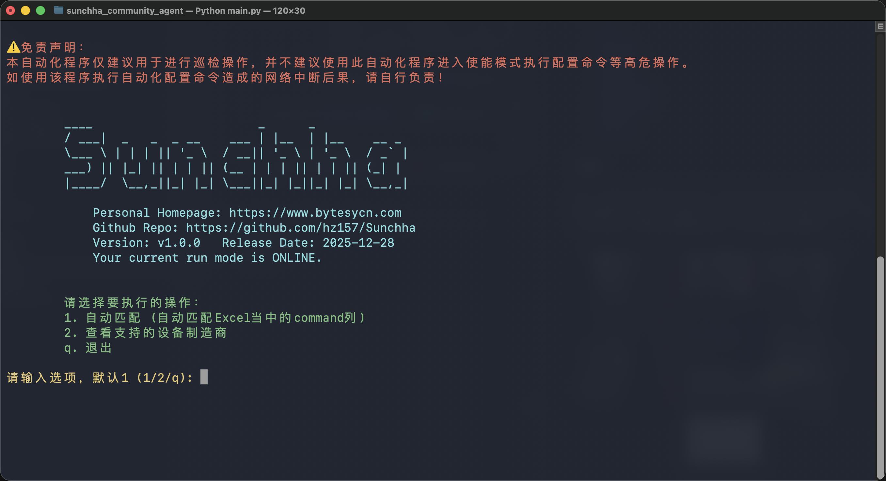
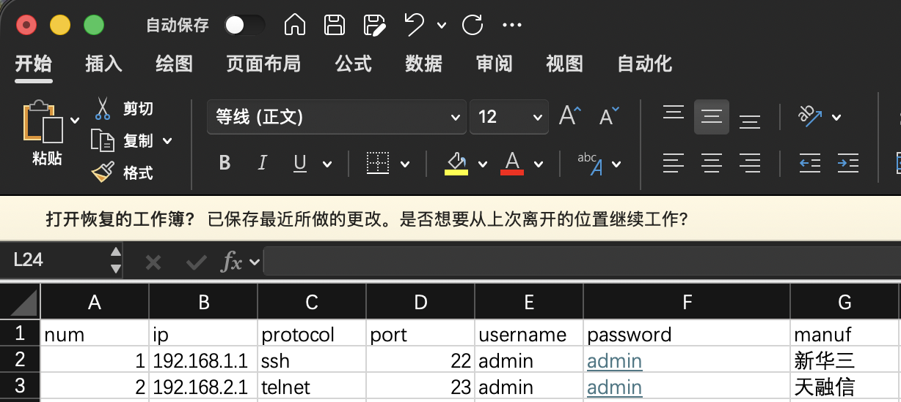
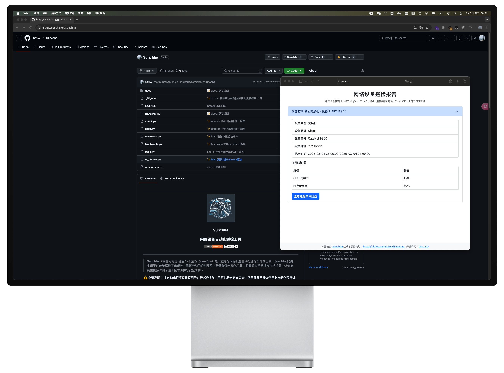

# 
<p align="center"></p>
<h3 align="center">Sunchha</h3>
<h3 align="center">网络设备自动化巡检工具</h3>
<p align="center">
  <a href="https://www.gnu.org/licenses/gpl-3.0.html#license-text"></a>
  <a href="https://github.com/hz157/Sunchha"></a>  
</p>
<hr/>

> **Sunchha**（取自闽南语“巡查”，发音为 *Sûn-chhá*）是一款专为网络设备自动化巡检设计的工具。Sunchha 的诞生源于对传统巡检工作低效、重复劳动的深刻反思。希望借助自动化工具，将繁琐的手动操作交给机器，让你能腾出更多时间专注于技术深耕与安全防护。

⚠️ 免责声明：
本自动化程序仅建议用于进行巡检操作，**虽可执行自定义命令，但目前并不建议使用此自动化程序进入使能模式执行配置命令等高危操作。**
如使用该程序执行自动化配置命令造成的网络中断后果，请自行负责！

## 目录

- [介绍](#介绍)
- [核心功能](#核心功能)
- [应用场景](#应用场景)
- [离线模式（自定义命令）](#离线模式-自定义命令)
- [开发环境](#开发环境)
- [快速上手指南](#快速上手指南)
- [支持设备列表](#支持设备列表)
- [计划中的更新](#计划中的更新)
- [The End](#TheEnd)

## 介绍


作为一名网络工程师和安全工程师，我深知传统巡检方式既低效又繁琐——每天重复执行相似命令不仅耗时，而且容易出错。为了改变这一现状，开发了 **Sunchha**，帮助轻松管理网络设备，从而大幅提升运维效率。





## 核心功能

- **自动化巡检**  
  批量执行巡检任务，对各类网络设备进行状态检查，确保你能实时掌握设备运行情况。

- **灵活配置**  
  支持自定义命令与策略，满足各种网络环境下的多样化需求。

- **数据报告与告警**  
  自动生成详细巡检报告，并在发现异常时及时发出告警。（**功能规划中**）

- **开源安全**  
  完全开源，支持通过 `git clone` 下载代码，自行构建与部署，保障操作的透明性与安全性。


## 应用场景

- **网络运维自动化**  
  简化巡检流程，降低人工错误，让网络设备管理更加高效。

- **安全监控**  
  实时监控设备状态，迅速发现并响应潜在安全隐患，全面提升网络安全防护能力。

- **技术实践与学习**  
  为网络自动化和运维相关技术探索提供一个实战案例与学习平台。

## 离线模式-自定义命令

在离线模式下，Sunchha允许用户自定义巡检命令，这为不同网络环境下的设备提供了极大的灵活性。用户可以根据实际需求，添加、删除或修改命令，确保巡检任务能够准确、及时地完成。

### 自定义命令格式

自定义命令的格式为：
```
command1,command2,command3,...
```
其中，每个命令之间用英文逗号隔开，**逗号之间请不要增加空格**。

### 示例

假设你有一个思科交换机，你想添加一个自定义命令来查看交换机的端口状态，及查看交换机的版本信息，你可以在交换机的目标文件[./target/target.xlsx](./target/target.xlsx)中添加以下命令：
```
show interface status,show version
```

### 注意事项

- 自定义命令必须在OFFLINE模式下执行，这需要在配置文件中设置`run_mode=offline`。


## 开发环境
- Python 3.13.1 

## 快速上手指南
1. 克隆本仓库
```
git clone https://github.com/hz157/sunchha_community_agent
cd sunchha
```
2. 编辑待检测的目标文档excel [target/template.xlsx](./target/template.xlsx) 编辑完毕后将excel重命名为target.xlsx，路径不变（target/target.xlsx)



3. Windows 创建并激活python虚拟环境
```
python -m venv venv
./venv/Scripts/activate
pip install -r requirements.txt
python main.py
```
3. Linux 创建并激活python虚拟环境
```
python -m venv venv
source ./venv/bin/activate
pip install -r requirements.txt
python main.py
```


## 支持设备列表

> 支持市面上大部分网络设备
可访问下列接口获取当前支持列表 -> [api-community-sunchha](https://api-community-sunchha.bytesycn.cn/api/v1/manufacturer/all)

如果你有其他的可以提供issue或发送品牌及巡检命令和说明到[ryanzhang@bytesycn.com](ryanzhang@bytesycn.com)

## 计划中的更新
目前计划中的更新主要有两个
1. 导出报告 PDF格式或HTML格式；
2. AI分析巡检结果并输出到计划1中的报告。


<!-- ## 报告样式
当前开发中的报告样式为HTML，可交换式报告以及PDF格式的报告。
 -->


## TheEnd
欢迎大家Star、使用并贡献代码，共同推动网络自动化运维的进步！<br>
愿 **Sunchha** 成为你在网络巡检工作中的得力助手，释放双手，拥抱无限可能！

